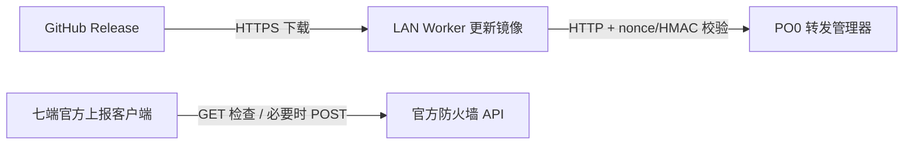

# PO0 转发管理与官方上报

从 `2026.09.08+build.1` 起，PO0 自建防火墙、来源白名单、DDNS 上报、SSH/HTTP 接收器、WebAuth、来源学习及 iplist/ipdb 任务退出主线。旧版源码、脚本、APK、文档与测试保存在固定归档中。

## 组件与安装位置

| 组件 | 运行位置 | 保留职责 |
| --- | --- | --- |
| `nftables-relay-manager.sh` | PO0 | 转发规则、NAT/SNAT、可选 MSS/BBR、诊断、备份恢复、鉴权更新 |
| `po0-lan-client.sh` | 能访问 GitHub 的 LAN Worker | 固定 manager 脚本更新镜像 |
| Linux / macOS / Windows 上报器 | 访问设备 | 官方账号上报、只读查询、定期与网络触发、本机配置 |
| OpenWrt APK | 主路由或旁路设备 | 官方 WAN/源地址绑定、UCI、procd、LuCI |
| Egern / Stash / Loon | 手机客户端 | 官方上报与本机状态界面 |



PO0 无法直连 GitHub，继续使用 Worker HTTP 镜像。现有更新地址、服务名、密钥、nonce/HMAC 协议及 `/po0-manager-update/nftables-relay-manager.sh` 路径保留。镜像只能下载固定的 Release manager 资产，不能转发任意 URL。

## 下载与构建

五个脚本的正式下载入口是 [GitHub Latest Release](https://github.com/SchweppesSoda/VPS-Toolkit/releases/latest)。下载后核对该 Release 的 `checksums.txt`，再上传或安装。脚本名称保持不变：

- `nftables-relay-manager.sh`
- `po0-lan-client.sh`
- `po0-outbound-ip-report.sh`
- `po0-outbound-ip-report-macos.sh`
- `po0-outbound-ip-report.ps1`

OpenWrt 使用 [APK 2026.09.08-r1](https://github.com/SchweppesSoda/VPS-Toolkit/releases/tag/po0-apk-v2026.09.08.1) 的固定版本下载地址。APK 不使用 Latest URL。手机模块继续使用 `scripts/po0/nftables/clients/` 下的公开 raw 文件；历史文件名是导入兼容标识，不表示还支持自建上报。

本地按 manifest 构建和检查：

```bash
bash tools/po0/check-po0-assets.sh
```

Windows 对应入口：

```powershell
./tools/po0/check-po0-assets.ps1
```

检查需要 Bash、Node.js、Python 3、PowerShell。Windows 使用 Git Bash；构建输出仅放在仓库 `.tmp/po0-*` 下。

### 选择发布范围

`po0-scripts-vYYYY.MM.DD.N` 发布五个脚本和校验文件，并可成为 Latest；`po0-apk-vYYYY.MM.DD.N` 只发布 APK 与校验文件，保持非 Latest。整包 tag `po0-vYYYY.MM.DD.N` 仍受支持。内部版本必须对应 tag；流程先创建 draft、上传全部资产并回下载校验，再公开。

## 已有设备迁移

本次源码发布不操作设备。按下面顺序在各设备迁移；每一步保留本机备份，失败可修正后重试。

1. 核实 PO0 已退出旧输入保护和来源白名单。新版 `--migration-check` 检查配置与运行中的托管表；发现保护仍启用时拒绝转换。需用固定归档版退出旧保护，再检查，不能靠删除配置字段绕过。
2. 在 Worker 先备份、迁移其官方账号，再停用旧接收与轮询。更新镜像可继续使用原地址和配对。新版不自动更换密钥。
3. 在 PO0 使用镜像更新 manager，执行 `--migrate-retired-state` 清理旧任务和活动状态。这一步不重新应用 nftables。
4. 更新设备上的官方客户端，执行显式迁移，清理旧自建计划；检查保存的名称、槽位、间隔及停用选择。
5. 更新手机模块及配置，确认只留下官方操作和状态组件。不要同时启用内置与独立 Stash override。

### LAN Worker 的官方账号

Worker 从此不执行官方上报。把已下载的新版 Linux 单文件上报器放在同一台机器；Linux 单文件也支持安装在带 Bash/Python 3 的 OpenWrt 上。使用以下入口导入原账号：

```bash
po0-lan-client --migrate-official /path/to/po0-outbound-ip-report.sh
```

迁移先从 `pre-retirement-v1/settings.env` 安全解析 Token/槽位，遇到已有不同配置或明确清空停用的目标即停止。配置保存成功后停止旧 Worker 任务，再按原计划启用新的官方任务；已停用的账号不会自动启用。新计划仍走本机正常路由，遵循原有 OpenClash 行为，不引入 WAN 源地址绑定。

这条入口使用 Linux 单文件上报器，并非 APK 的 WAN 绑定适配器。原 Worker 和 APK 的网络语义不同，不能静默互换。Worker 未配置官方账号时，可直接执行 `--migrate-retired-state`。旧设置、目标列表、当前脚本、crontab 和相关服务配置保存在配置目录的 `pre-retirement-v1/`。

### 桌面客户端

Linux / macOS：

```bash
po0-outbound-ip-report --migrate-retired-state
```

macOS 也可用原安装脚本路径加同一参数。Windows：

```powershell
./po0-outbound-ip-report.ps1 -MigrateRetiredState
```

配置另存为 `.pre-retirement-v1`，旧任务另行备份；官方 Token、名称、槽位、间隔、自动/定期/网络开关及通知偏好保留。旧自建参数不会参与请求，明确指定旧自建动作时只返回退役提示。正常保存只写官方与通用设置。

OpenWrt APK 升级脚本先把 UCI 备份到 `/usr/lib/po0/legacy/official-only-v1/config`，再移除自建字段。官方目标、WAN 绑定、源地址、DNS、间隔及停用开关保留；procd 仅启动 `official` 实例。失败不会标记完成，修正后可重试。

手机首次执行在本机保存不可覆盖的迁移快照，移除活动自建字段。Token 清空后保留停用记录，同步来的旧参数不能复活。Stash 首页 Tile 仅同步读缓存，不访问网络、不迁移、不写存储。

## 官方上报与界面

官方账号最多 5 个槽位，始终先 GET。缺失或指定槽位不匹配时才 POST；查询入口只读。Egern 的同 `/24` 网段可共用已占槽位，HTTP 403 后只复查一次，不重复写入。名称仅用于显示，不改变账号和槽位。

定期上报默认 600 秒，可调整或关闭；停用定期保留原间隔，网络触发单独设置。支持 SSID 读取的设备使用本机跳过规则，读取失败继续；强制操作只绕过本机条件。SSID 不随官方请求上传。Stash 没有公开 SSID API/原生网络变化事件，使用每分钟出口变化轮询。

Egern、Loon、Stash 的按网络选择默认关闭；启用后原目标用于蜂窝，Wi-Fi 使用另填列表，用户保存的槽位不变。Egern 小组件按尺寸显示官方账号、槽位、占用和当前 IP；Stash 紧凑 Tile 显示摘要与前两个账号，点击进入完整管理页；Loon 最近结果只读。

主 OpenWrt 使用 mwan3 选择 WAN，旁路 OpenWrt 使用本机专用源地址并保留上游 WAN-only 分流。地址缺失或指定 WAN 故障不回退。其它客户端保持现有官方请求网络行为。Token 只在受保护的配置和主动打开的本机编辑页中出现，不进入日志、通知、运行状态或命令参数。

## 备份与恢复

manager 的新版备份只含转发配置、规则与更新配对，恢复后不自动应用规则；完整旧备份必须使用固定归档版。Worker 的新版备份只含更新配置和密钥，恢复不启动服务。旧备份格式不混入新职责。

旧版资产固定在 [archive/po0-full-20260907.1](https://github.com/SchweppesSoda/VPS-Toolkit/releases/tag/archive/po0-full-20260907.1)，包括源码 ZIP、五个脚本、APK、manifest、校验文件和恢复说明。该 Release 始终非 Latest，不覆盖 tag，也不建立维护分支。下载后先校验 `checksums.txt`，按 `RESTORE.md` 恢复到单独目录核对；不要直接覆盖当前设备配置。

私有 ProxyConfig 的配置与凭据资产只在其私有仓库的同名 tag/Release 中归档，不进入公开资产。

实现边界见 [技术说明](po0-relay-technical.md)，变更记录见 [CHANGELOG](CHANGELOG.md)，Egern 导入见 [Egern README](../nftables/clients/egern/README.md)。
